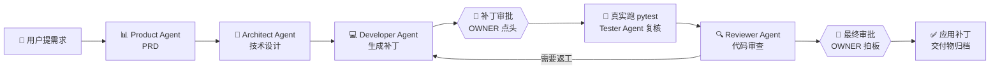
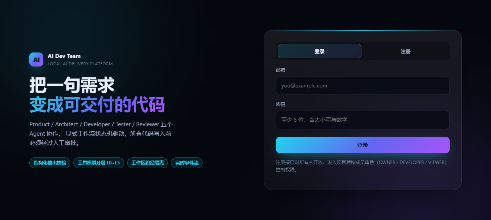
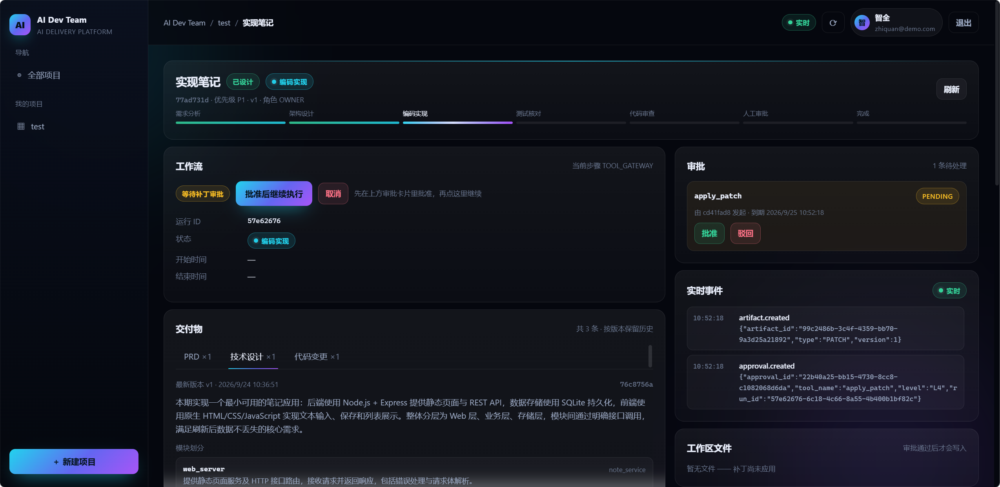
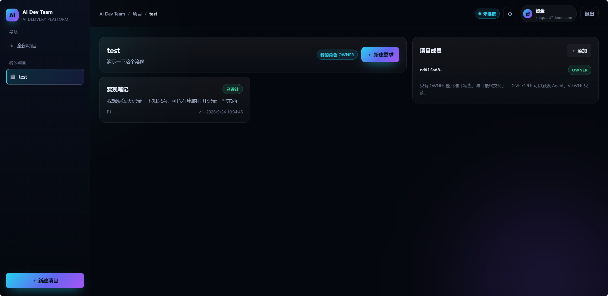
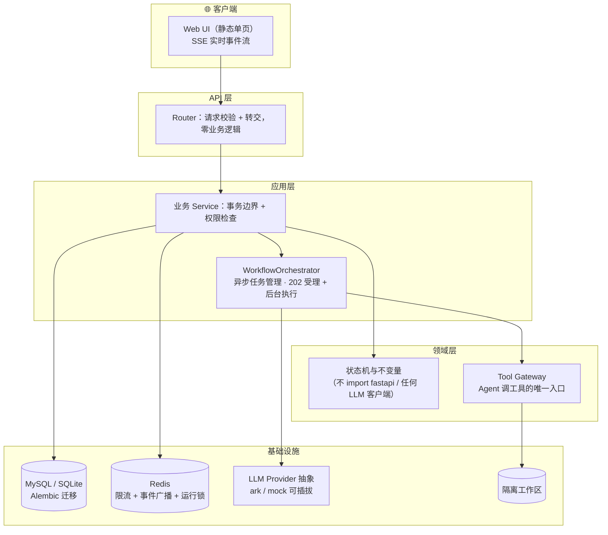
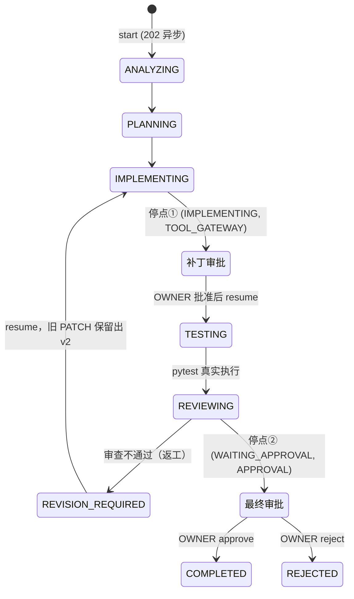

<div align="center">

# 🤖 AI Dev Team

**把一条需求交给 AI 开发团队：分析 → 设计 → 写码 → 测试 → 审查 → 人工拍板**

一个可本地部署的 AI 软件开发团队协作平台。AI 负责理解与生成，后端负责权限、状态、数据与工具边界 —— 模型再聪明，也不能越过审批去碰你的文件。

[](https://github.com/PopZack/AI-Development-Platform/actions/workflows/ci.yml)


</div>

---

## ✨ 一条需求的完整旅程



启动一条工作流 **0.03 秒返回（202 异步受理）**，全程进展通过 SSE 实时推送到界面 —— 用户永远不用盯着转圈的按钮等模型跑完。

## 🖼️ 界面一览

| 登录 | 需求详情 · 七步状态导轨 | 项目详情 · 需求与成员 |
|:---:|:---:|:---:|
|  |  |  |

深空商务风单页应用，FastAPI 直接托管 —— 不用框架、不用构建步骤，`docker compose up` 即用。

## 🚀 快速开始

**Docker（推荐，多人部署形态）：**

```bash
git clone https://github.com/PopZack/AI-Development-Platform.git
cd AI-Development-Platform
cp .env.example .env        # 填 4 个值：JWT_SECRET_KEY / LLM_API_KEY / LLM_MODEL / MYSQL_PASSWORD
docker compose up -d --build
# 打开 http://localhost:8000/ui/
```

**本地开发：**

```bash
uv sync                     # 安装依赖
cp .env.example .env
uv run uvicorn app.main:app --reload
# Swagger: http://127.0.0.1:8000/docs
```

**部署验收不用背清单，跑冒烟脚本：**

```bash
python scripts/smoke_stack.py        # 起栈 → 10 项检查 → 拆栈，退出码非 0 即失败
```

> LLM 通过 Provider 抽象接入，默认火山方舟（OpenAI 兼容协议，httpx 直连）。
> 换供应商 = 新增一个实现类 + 改配置，Agent / Prompt / 校验层一行不动。

## 🏗️ 架构



| 模块 | 职责 |
|---|---|
| `app/api` | Router 只做请求校验与转交 |
| `app/application` | 业务用例编排，事务边界，异步后台任务 |
| `app/domain` | 实体状态机与不变量 —— **不允许出现 `import fastapi` 或 LLM 客户端** |
| `app/agent` | 五个 Agent 角色 + 统一运行时（调模型 → Pydantic 校验 → 落库） |
| `app/workflow` | 显式工作流状态机 |
| `app/infrastructure` | Tool Gateway、LLM Provider、限流、SSE、工作区 |

数据模型 9 张核心表：`users` / `projects` / `project_members` / `requirements` / `workflow_runs` / `agent_runs` / `artifacts` / `approvals` / `tool_calls`。

## 🛑 人工审批是流程的一部分，不是补充



- **Developer 可以启动工作流，但不能拍板** —— `approve` / `reject` 仅 OWNER，刻意的职责分离
- **补丁先给人看，再写盘**：`generate_patch`（L2）只产出 diff → 自动发起审批 → OWNER 批准 → `apply_patch`（L4）才真正落盘；一条审批只能换一次成功执行（防重放）
- **返工在同一 resume 请求内闭环**：审查打回 → 重新实现 → 新审批，旧补丁按版本保留
- 运行/审批在界面上实时可见：事件流推送每一步状态迁移、交付物与审批卡片

## 🛡️ 安全设计：模型被关在笼子里

| 防线 | 做法 |
|---|---|
| **Tool Gateway 唯一入口** | L0 读上下文 / L1 读代码（记录）/ L2 生成补丁 / L3 跑测试（白名单）/ **L4 应用变更（需人工审批）** / L5 部署·删数据（禁止）。任何一个 Agent 自己 `open()` 文件，整套约束同时失效 —— 所以所有调用必须过同一道门 |
| **模型输出必过校验** | 未通过 Pydantic Schema 的输出只留原文 + 报错，**绝不落库**；重试时把坏输出和校验错误一起发回去让模型改 |
| **执行模型写的代码** | 只此一处（`run_pytest`）：固定解释器、参数白名单、cwd 锁定、剥离密钥环境变量、超时/输出上限。README 不把它说成强边界 —— 真隔离靠容器 |
| **路径校验** | 解析为规范化路径后判断在授权根内，不用字符串前缀（`/workspace` 前缀匹配不了 `/workspace-evil` 的把戏） |
| **会话撤销** | `token_version` 版本号比对，登出/改密立即踢掉全部令牌，零额外查询（鉴权本来就要读 users 行） |
| **限流** | 三档：llm 10/min（最贵的资源）、auth 20/min 按 IP（反爆破）、default 300/min；限流键 = 令牌指纹；Redis 挂了 fail-open |
| **生产护栏** | `APP_ENV=prod` 下默认 JWT 密钥 / Mock Provider / 空 API Key → **直接拒绝启动**，不带着占位配置安静地跑 |

## 🧪 质量与验证

| 维度 | 数字与事实 |
|---|---|
| 测试 | **397 个用例**三套件全绿；支持 `TEST_DATABASE_URL` 跑**真 MySQL**（每用例独立建库，全量 391s） |
| CI | 四 job：lint+unit / **真 MySQL 8.4 service container**（先验证 Alembic 迁移）/ **生产镜像同依赖集合 import 冒烟** / 整栈冒烟（main + nightly） |
| Agent 评估集 | mock 模式自测评估器 + real 模式量化，判给模型前先证明「评估器本身可信」；真实模型 **8/8 稳定通过**（每例 2 次） |
| 真机验收 | MySQL 8.4 完整工作流 `COMPLETED`、Alembic vs create_all 零差异、中文/emoji 无损、跨实例事件经 Redis 送达 |
| 注入验证 | 故意注入「坏迁移」「删 httpx」→ CI 三个 job 恰好各自红在对的步骤，防线真实有效 |

CI 三道防线对应三类「**本地全绿、上线才炸**」：方言差异（SQLite 容忍、MySQL 炸）、依赖集合差异（dev 组有、镜像里没有）、失败方式差异（进程内假跑、容器真跑）。

## 📡 API 一览

统一前缀 `/api/v1`，统一错误格式（`code` / `message` / `request_id` / `details`），`request_id` 贯穿全链路日志。

| Method | Path | 说明 |
|---|---|---|
| POST | `/auth/register` · `/auth/login` | 注册 / 登录（JWT） |
| POST | `/projects` · `/projects/{id}/requirements` | 项目与需求（创建者自动 OWNER，**取自令牌**） |
| POST | `/requirements/{id}/runs` | 创建工作流，**必须带 `Idempotency-Key`**（双击启动不会产生两条） |
| POST | `/runs/{id}/start` · `/resume` | **202 异步受理**，执行在后台；事件流观察进展 |
| POST | `/runs/{id}/approve` · `/reject` | 仅 OWNER |
| POST | `/requirements/{id}/analyze` · `/plan` | 单独触发 PRD / 技术设计 |
| GET | `/requirements/{id}/events` | SSE 实时事件流 |
| GET | `/requirements/{id}/deliverables` | 交付物汇总：五类交付物最新版 + 工作区文件清单 |
| GET | `/requirements/{id}/approvals` | 审批列表（也可被 409 响应自动创建） |

<details>
<summary><b>展开：幂等键与权限的完整语义</b></summary>

**幂等键（创建工作流必须带）：**

| 情况 | 状态码 | 说明 |
|---|---|---|
| 新建成功 | `201` | 返回这条工作流 |
| 同键重放 | `200` + `Idempotent-Replay: true` | 返回**当初那条** |
| 同键用于另一需求 | `409` `IDEMPOTENCY_KEY_CONFLICT` | 客户端 bug，不是重试 |
| 不带键 | `422` | 「双击启动」会安静地产生两条，所以不给建 |

为什么可靠：应用层「先查再插」在并发下会双双读到「不存在」，真正兜底的是数据库 UNIQUE 约束 —— Service 捕获 `IntegrityError` 后回读已存在那条，按重放返回而不是抛 500。

**权限模型（项目级，无全局管理员）：**

| 角色 | 读 | 建/改需求 | 改项目·管成员 |
|---|---|---|---|
| OWNER | ✅ | ✅ | ✅ |
| DEVELOPER | ✅ | ✅ | ❌ |
| VIEWER | ✅ | ❌ | ❌ |

- 越权返回 **403 不伪装成 404**（UUID 不可枚举，帮助排查比藏资源存在性更有价值）；响应里带 `details.actual_role` / `required_roles`，前端不用靠猜
- 令牌缺失/过期/篡改/撤销分别返回四个不同 code；对未认证调用方不暴露差异，避免提示攻击者差在哪一步

</details>

## 📈 实测数据（真模型、真端点）

| 指标 | 实测 |
|---|---|
| start/resume 响应 | **0.03s**（202 受理；同步时代用户阻塞 394s+） |
| 完整工作流（真模型） | 停点① 196s → 停点② 301s → `COMPLETED`，5 份交付物，**用户阻塞时间 ≈ 0** |
| Developer 单步 | 323s / 18.4k tokens（长推理）—— 所以请求必须**流式**，读超时从「总时长上限」变「块间隔上限」 |
| 评估 | 真实模型 4 用例 × 2 次 **8/8 稳定** |

<details>
<summary><b>展开：流式与超时的踩坑实录（为什么 <code>stream: True</code> 是硬要求）</b></summary>

- **`completion_tokens` ≠ 输出规模**：Developer 一次 18,440 completion token，落库正文只有约 4KB —— 差额是模型内部推理 token（端点下发 `reasoning_content`）。拿 completion 判「输出太长」会得出反向结论
- httpx 的 timeout 是**读超时**（两块数据间最大间隔）。非流式下「整包算完才发第一个字节」→ 读超时退化成总时长上限，推理期可到 300s+ → **必然超时**；流式下块间隔亚秒级（实测首字节 1.0s、块间最大 0.8s）
- **超时不重试**：抖动是随机的，重试有意义；超时说明 provider 在推理或排队，立刻重试 = 再压一份同样负载。实测 `max_retries=2` 让注定失败的请求白等 **540s**；改判后最坏等待 180s，快速失败
- 端点行为用探针量，别推断（`scripts/probe_llm_endpoint.py`）：`max_tokens` 被**忽略**（要 60 实得 1426）→ 代码里任何输出上限都是假保证，已改为不下发；`max_completion_tokens` 生效但不能当护栏（把推理算进预算，额度低了回答直接变空串）

</details>

## 🧭 深度设计决策（为什么这么做）

<details>
<summary><b>LLM Provider：两类重试必须分清 + 方舟三条路径的坑</b></summary>

- **传输层重试**（网络抖动/5xx/429，指数退避）与**内容层重试**（模型回了非法 JSON，带上坏输出与校验报错重写）混成一体会很糟：坏 JSON 时传输层白等三轮退避，网络抖动时内容层又去重写 Prompt
- **401 / 403 / 400 一次都不重试** —— 它们重试一万次也一样失败
- ⚠️ 火山方舟有三条 base URL（`/api/v3`、`/api/plan/v3`、`/api/coding/v3`），**key 按路径划分**，配错的表现是 401 且报错不提示端点问题。`llm_api_key` / `llm_base_url` / `llm_model` 必须配成同一套
- 不引第三方 SDK，只用 httpx：少一层依赖漂移，各家 SDK 异常类型不统一反而让抽象层更难做干净
- `agent_runs` 一行 = 一次 provider 调用（`execution_id` 共享、`attempt` 递增），`parsed_json` 只有通过校验才写；`INVALID_OUTPUT`（模型不听话）与 `FAILED`（基础设施不稳）刻意分开

</details>

<details>
<summary><b>异步执行：并发裁决、取消语义与崩溃恢复</b></summary>

- **start 并发裁决**：数据库原子认领（`UPDATE … WHERE status='CREATED'`），跨 worker 有效
- **resume 并发裁决**：进程内注册表 + Redis 运行锁（TTL 90s、30s 心跳续期），撞锁 409 `WORKFLOW_RUN_BUSY`
- **取消在步边界生效**：主循环每轮查真实状态，取消最多延迟一个步骤生效，而不是掐断进行中的模型调用
- **崩溃不留僵尸**：进程重启时执行中的运行标记 `FAILED / INTERRUPTED`（活 worker 持锁的除外）；后台任务任何异常用独立会话兜底标 FAILED
- 两个停点都用「合法状态 + 特定 `current_step`」表达，**没有新增状态**；`status` 是对外阶段、`current_step` 是阶段内环节（排障粒度）

</details>

<details>
<summary><b>SSE 实现的两个必踩坑（都写进了代码注释与测试）</b></summary>

1. **不要用 `asyncio.wait_for(anext(订阅), timeout)` 做心跳** —— 超时会取消取件协程并连带杀掉异步生成器，**第一次心跳后事件永不送达**。正确做法：取件任务常驻，只给「等待」加超时
2. **不要调 `request.is_disconnected()`** —— 它不是非阻塞检查，测试传输下「等断线」变死锁。`StreamingResponse` 自己会取消断线的生成器

另：事件是单向旁路数据，权威状态在 `GET /runs/{id}`，所以**刻意不做**断点续传；反向代理记得关 `proxy_buffering`。

</details>

<details>
<summary><b>数据库迁移与跨方言（Alembic、外键环、MySQL 才暴露的 bug）</b></summary>

- **`create_all()` 只建缺失的表，不给已有表加列** —— 发新版本时静默失效，运行中报 `no such column`。生产 `AUTO_CREATE_TABLES=false`，结构一律走 Alembic
- **外键环真机才炸**：`approvals ↔ tool_calls` 互相引用，SQLite 容忍、create_all 延后成 ALTER，只有 autogenerate 的内联外键迁移在 MySQL 直接 1824。修法是拆环 + 三个守卫用例（含「迁移建表顺序必须满足被引用表已存在」—— 唯一能不连 MySQL 就提前发现它的地方）
- MySQL `DATETIME` 默认秒精度会把微秒四舍五入 → 时间戳列统一 `DATETIME(fsp=6)`；同类型记录排序第一键必须是 `created_at`（version 是类型内编号，无全局区分度）
- `alembic.ini` 保持纯 ASCII（GBK locale 下中文注释让所有命令崩）；`env.py` 必须 `import app.models`（否则 autogenerate 生成删库迁移）
- 跨方言守卫：把全部表的 CREATE TABLE 编译成 SQLite/MySQL/PG 三种方言断言通过 —— 不连真库就能抓到绝大多数类型不兼容

</details>

<details>
<summary><b>部署细节：依赖集合、镜像构建与「配了却不生效」</b></summary>

- 部署依赖铁律：compose 配了 `REDIS_URL` 就必须装 `redis` extra（否则**静默退化**成进程内状态 —— 额度×worker 数、SSE 时有时无）；`mysql` extra 必须含 `cryptography`（MySQL 8 `caching_sha2_password`）。都固化成静态守卫用例
- **`REQUIRE_REDIS=true` 把 Redis 从可选项变硬依赖**：URL 没配、包没装、ping 不通，三种情况都拒绝启动。redis-py 连接是惰性的，必须真 ping
- 启动自检一行：`events=redis` 是 Redis 生效的唯一直接证据（看到 `in-process` 就是没配到位）；连接串脱敏进日志（有静态检查守着）
- 镜像坑：不在 runtime 阶段 `apt-get install`（健康检查改用 urllib，省掉整个 apt 层）；「导入写了、依赖放 dev 组」会让镜像启动即崩（httpx 案）—— 静态检查扫 `app/` 顶层导入对照主依赖传递闭包
- 国内拉不到 Docker Hub：从可用镜像源拉取后**打官方同名 tag**，compose 一字不改
- 慢调用告警 `LLM_SLOW_CALL_SECONDS`：告警不是失败判定，阈值写成断言会把 provider 正常波动变成故障

</details>

<details>
<summary><b>Agent 评估集：先证明评估器可信，再谈模型表现</b></summary>

- `mock` 模式回答「**评估器本身可信吗**」：预置的好输出必须全过、坏输出必须挂 —— 没有它，断言路径写错时 real 模式的低分会被误读成「模型不行」
- 三条纪律：**必须有坏样本**（只有好样本，永远说没问题的模型能拿满分）；**断言必须可判定**（不接受主观打分）；**判断类任务必须重复跑**（`--repeat N`，单跑一次的分数不能当结论）
- 「对照组必须 approved」是错的断言：严格的审查者总能找出成立的意见，该断言只奖励宽松。改成 `findings_substantiated` —— 打回可以，但每条 blocker/major 必须指明**文件 + 具体问题**
- 一次真实评估中，模型连续四轮指出的反对意见**全部成立**（都是 fixture 的错）—— 顺带证明了审查者在真读代码

</details>

<details>
<summary><b>已知取舍（不是遗漏，是选择）</b></summary>

- 扩展表只建了 `tool_calls`，`code_changes` / `test_runs` / `review_findings` / `audit_logs` 暂缓 —— 依据设计文档「不要为了完整的企业级表结构一次性实现所有表」，逐张理由见原决策记录
- 任何登录用户可见全部用户邮箱（`GET /users`）—— 「添加项目成员」流程可用性的代价；对外部署应收紧或脱敏
- 账号停用没有 API 入口 —— 设计文档没定义全局管理员，不凭空造一个
- SSE 支持 `?token=` 给第三方集成（query 传令牌会进访问日志），自家前端用 fetch 流式读走请求头
- L3 环境变量剥离是尽力而为不是边界；超时杀的是 pytest 进程本身 —— 真隔离靠容器级部署

</details>

<details>
<summary><b>部署运维：上线检查清单与国内镜像源</b></summary>

**上线前检查清单：**

- [ ] `JWT_SECRET_KEY` 换成真随机值（≥ 32 字节）；prod 下配置层拒绝默认值
- [ ] `REQUIRE_REDIS=true`（compose 已设）：Redis 连不上拒绝启动而非静默退化
- [ ] `DEBUG=false` —— 开着会把根 logger 降到 DEBUG，业务日志被内部细节淹没
- [ ] `LLM_API_KEY` / `LLM_MODEL` / `LLM_BASE_URL` 配成**同一套**（方舟三条路径不通用）
- [ ] 反向代理后开 `RATE_LIMIT_TRUST_PROXY=true`，且代理确实重写 `X-Forwarded-For`（否则客户端可伪造该头绕过限流）
- [ ] SSE 路径关 `proxy_buffering`，否则事件被攒着不发
- [ ] `WORKSPACE_ROOT` 落持久卷；挂 HTTPS；备份 `mysql_data` 与 `workspace` 卷

**拉不到 Docker Hub 时（不改 compose）：** 从可用镜像源拉取后打官方同名 tag，`pull_policy: missing` 会直接用本地镜像：

```bash
# 先探哪个源可用（2026-09-23 实测：daocloud / 1panel 可用）
docker pull docker.m.daocloud.io/library/mysql:8.4
docker tag  docker.m.daocloud.io/library/mysql:8.4 mysql:8.4
docker pull docker.m.daocloud.io/library/redis:7-alpine
docker tag  docker.m.daocloud.io/library/redis:7-alpine redis:7-alpine
docker pull docker.m.daocloud.io/library/python:3.12-slim
docker tag  docker.m.daocloud.io/library/python:3.12-slim python:3.12-slim
```

**多人部署必须换掉的两样东西：** SQLite → MySQL/PG（单文件写锁扛不住并发写事务）；进程内限流/事件 → Redis（多 worker 不共享状态）。

</details>

## 📂 项目结构

```
AI-Development-Platform/
├── app/                    # FastAPI 应用（api / application / domain / agent / workflow / infrastructure / common）
├── web/                    # 深空商务风 Web UI（无框架无构建，FastAPI 托管 /ui）
├── migrations/             # Alembic 迁移（跨方言）
├── tests/                  # 397 用例：unit / integration / api（支持真 MySQL）
├── evals/                  # Agent 评估集（mock 自测 / real 量化）
├── scripts/                # 整栈冒烟 smoke_stack.py · LLM 端点探针 · 评估入口
├── shots/                  # 界面截图（真实运行）
└── docker-compose.yml      # app(4 worker) + MySQL 8 + Redis
```

## 🗺️ 实施阶段

| 阶段 | 内容 | 状态 |
|---|---|---|
| Stage 1 | 基础 API + CRUD + 统一错误 | ✅ |
| Stage 2 | JWT 认证 · 资源级权限 · 幂等键 | ✅ |
| Stage 3 | LLM Provider 抽象 · Product/Architect Agent · 结构化输出校验 | ✅ |
| Stage 4 | 工作流状态机 · Developer/Tester/Reviewer · Tool Gateway · 审批闭环 | ✅ |
| Stage 5 | SSE · 限流 · Web UI · Alembic/MySQL · 容器化 · 评估集 · **异步执行** | ✅ |

## License

[Apache-2.0](LICENSE)
